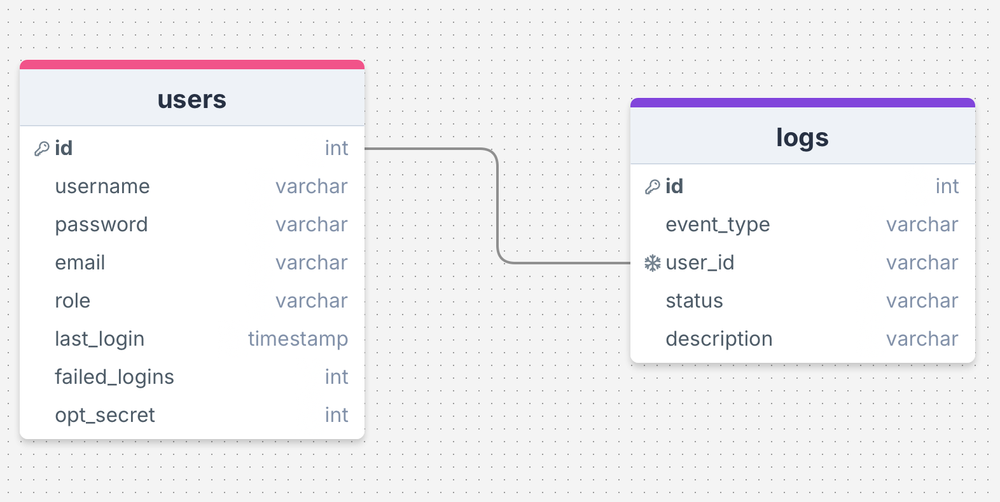

# HASHpassword: Password Management for Telecommunication Environments
**HASHpassword** is a cutting-edge application designed to ensure secure password management and authentication within modern telecommunication environments. Leveraging the latest advancements in security technologies, HASHpassword offers robust solutions to safeguard sensitive data and user credentials.

**Key Features:**

- Secure Registration and Login: Implements strong encryption protocols to protect user credentials during account creation and authentication.
- Two-Factor Authentication (2FA): Enhances security with a seamless integration of TOTP-based 2FA.
- Password Management: Facilitates secure handling of passwords, ensuring compliance with industry standards for password complexity and storage.
- Dynamic QR Code Integration: Generates and displays QR codes within the application for easy setup of 2FA, eliminating the need for external tools.
- User-Friendly Interface: Offers a clean and intuitive GUI.
- Versatile Telecommunication Support: Tailored to meet the specific security challenges faced by telecommunication systems.

<br>


# Technologies and Libraries
<br>

### Password and Security Management:


1. bcrypt
    
   - Library for password hashing, ensuring secure storage of user credentials.


2. cryptography
   
   - Provides cryptographic recipes and primitives, including encryption, decryption, and secure key handling.


3. pyotp

   - Implements Time-based One-Time Password (TOTP) and HMAC-based One-Time Password (HOTP) algorithms for 2FA functionality.

<br>


### Database Connectivity:


1. mysql-connector-python

   - MySQL driver for Python, enabling efficient interaction with MySQL databases for user data storage and retrieval.

<br>


### QR Code Generation:


1. qrcode

   - Library for generating QR codes, facilitating the easy setup of 2FA for users.
<br>


### Graphical User Interface and Image Processing:


1. pillow
   
   - Python Imaging Library (PIL) fork for image processing, used for displaying and resizing QR codes.

<br>

### Low-Level Dependencies:


1. cffi
   
   - C Foreign Function Interface for Python, used as a dependency for interacting with low-level cryptographic libraries.
     

2. pycparser
   
   - C parser and AST generator, often used as a dependency by other cryptographic libraries.

<br>
<br>


## The representation of used database 
<br>
<br>




<br>
<br>


## A screenshoot of Google Authenticator using a QR code generated by the application
<br>
<br>


<br>
<br>


## How to Run

1. **Create a Virtual Environment**  
   Create a virtual environment in your project's root directory. This isolates your project's dependencies from the global Python environment.

   ```bash
   python3 -m venv venv
   ```
   
2. **Activate the Virtual Environment**  
   Activate the virtual environment to use its isolated environment for your project dependencies.

  #### On macOS and Linux:
  ```bash
  source venv/bin/activate
  ```

  #### On Windows:
  ```bash
  venv\Scripts\activate
  ```

3. **Install Dependenciest**  
   Install all the dependencies listed in the `requirements.txt` file using pip:

   ```bash
   pip install -r requirements.txt
   ```
   
4. **Set Up Environment Variables**  
   If your project uses environment variables, create a `config.json` file in the project's root directory and add the required variables. For example:

   ```bash
   FERNET_KEY=HaytxFPcnr9OC3waOFuOKLMjWE1HIsafPE6KxfarJV0=
   ```

5. **Run the project**  
   Now you can run your project. For example, if you have a `main.py` file, execute the following command:

   ```bash
   python main.py
   ```


   
